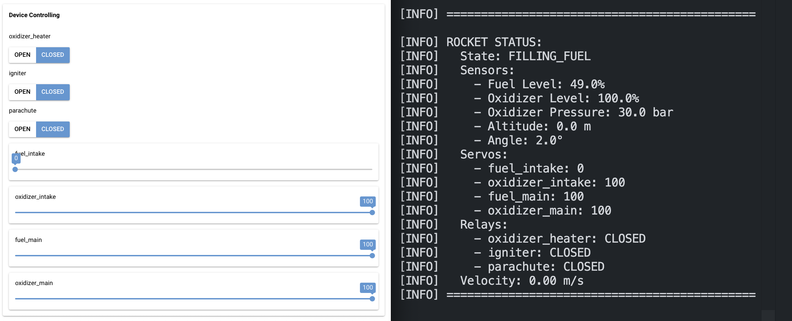

## 1. Klasa `Controller`

**`Controller`** to system sterowania rakietą, umożliwiający:

* kontrolę **serwomechanizmów** i **przekaźników**,
* odbieranie ramek **FEED** z rakiety,
* wizualizację statusu systemu w trybie **GUI** lub **CLI**.

### Metody do sterowania rakietą

* `set_servo(device_id, position)`
  Ustawia pozycję wybranego serwomechanizmu.

* `toggle_relay(device_id, state)`
  Przełącza stan przekaźnika (`ON` / `OFF`).

### Metody wewnętrzne

* `_receive_loop()`
  Pętla odbierania ramek danych FEED.

* `_process_frame(frame)`
  Przetwarzanie odebranych danych z rakiety.

* `print_rocket_status()`
  Wyświetlanie aktualnego statusu rakiety na podstawie:

  * danych z ramek **FEED**,
  * stanu przekaźników i serwomechanizmów.

* `validate_change()`
  Zapobiega wykonaniu niebezpiecznej operacji, która mogłaby doprowadzić do **eksplozji** (aktywne tylko w trybie **CLI**).

### Dodatkowo zdefiniowane wyjątki

* `UnknownCommand(Exception)` — nieznana komenda sterująca.
* `WrongOperationOrderCLI(Exception)` — błędna kolejność operacji prowadząca do eksplozji (wykorzystywane tylko w trybie **CLI**)


### Tryby uruchomienia kontrolera

#### **GUI (NiceGUI)**

Przykładowe uruchomienie (po uruchomieniu `tcp_proxy.py` i `tcp_simulator.py`):
```bash
python3 controller.py --control-type gui --print-logs no
```

Wygląd interfejsu GUI


#### **CLI**

Przykładowe uruchomienie (po uruchomieniu `tcp_proxy.py` i `tcp_simulator.py`):
```bash
python3 controller.py --control-type cli --operation set_servo --device-id 1 --new-value 0 --keep-running yes --print-logs yes
```

---

## 2. Symulacja lotu

Plik `start_example.py` zawiera przykład pełnej symulacji lotu rakiety, od startu do lądowania.
Sterowanie realizowane jest za pomocą klasy **`Controller`**.

Uruchomienie (po uruchomieniu `tcp_proxy.py` i `tcp_simulator.py`):
```bash
python3 start_example.py
```

---

## 3. Rysowanie wykresu prędkości rakiety w czasie

W klasie `StandaloneMock` dodana jest metoda:

```python
plot_rocket_vt()
```

Pozwala ona na rysowanie wykresu prędkości rakiety w czasie podczas lotu z użyciem biblioteki **matplotlib**.
Aby włączyć rysowanie, nalezy uruchomić symulator z parametrem `--plot-vt yes`:

```bash
python3 tcp_simulator.py --plot-vt yes
```


Przykładowy wykres uzyskany przy uruchomieniu `start_example.py`.
---